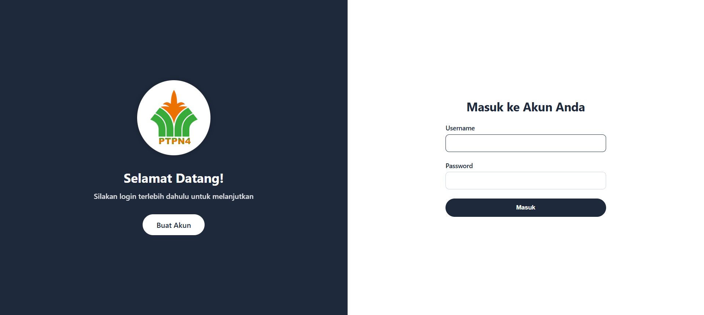
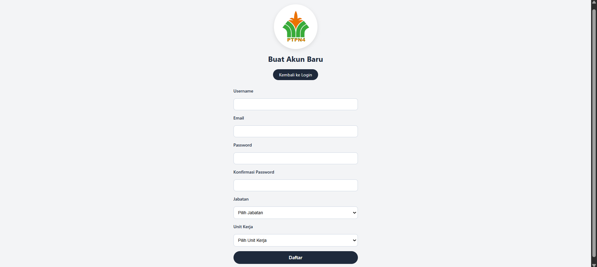
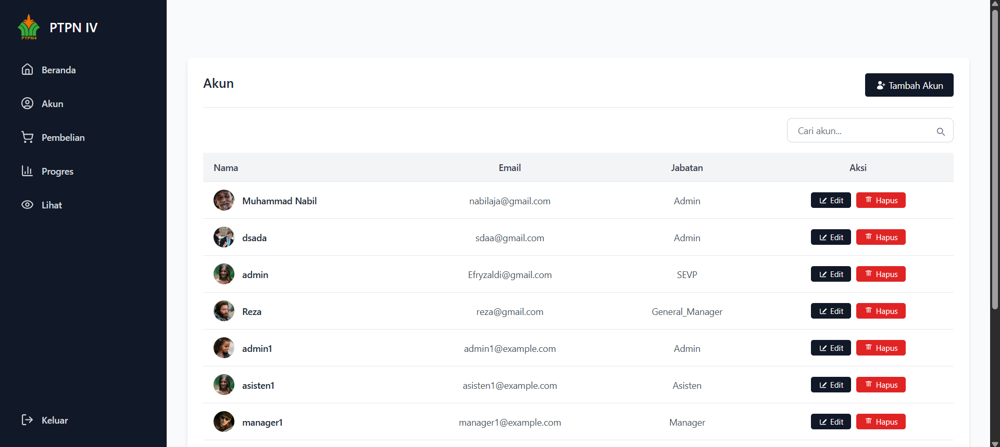

# 🌾 PTPN IV Regional 3 - Manajemen Pembelian CPO & PK

Proyek ini adalah sistem informasi berbasis web yang dirancang untuk mempermudah pengelolaan pembelian **CPO (Crude Palm Oil)** dan **PK (Palm Kernel)** di lingkungan **PTPN IV Regional 3**. Sistem ini dibangun dengan framework **Laravel**, menggunakan TailwindCSS untuk desain antarmuka modern dan responsif.

## 🖼️ Preview Tampilan

### 🔐 Halaman Login


### 📝 Halaman Register


### 📊 Dashboard Akun


---

## 🚀 Fitur Utama

- 🔐 Autentikasi pengguna (login & register)
- 📦 Manajemen data pembelian CPO & PK
- 📈 Visualisasi dan rekapitulasi data pembelian
- 🧾 Formulir input dinamis dengan validasi
- 📂 Multi-user role (Admin, Unit, dll)
- 🌐 Tampilan modern dan responsif

---

## 🛠️ Teknologi yang Digunakan

- **Framework:** Laravel 10
- **Frontend:** TailwindCSS, Blade
- **Database:** MySQL
- **Library tambahan:** Flowbite, Lucide Icons

---

## 📦 Cara Instalasi

1. **Clone repository ini**
   ```bash
   git clone https://github.com/Nabil17-alt/PTPN4Regional3.git
   cd PTPN4Regional3
